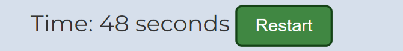
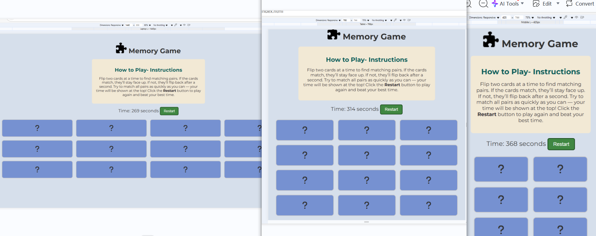

# Memory Game

**Memory Game** is a fun and interactive browser-based card matching game. Designed to strengthen memory muscles and improve focus, it offers a quick and engaging mental workout suitable for all ages. The gameplay is easy and straightforward—just flip cards to find matching pairs. To add a competitive edge, the game shows your completion time, allowing you to challenge yourself to beat your best score with every round.

[View the live site here.](https://hannamussa.github.io/zanzibartours/)

## UX

### Target Audience

This game is perfect for all ages—whether you're a child building cognitive skills, a student sharpening your memory, an adult in need of a mindful break, or an older adult keeping your mind active. With its simple mechanics and playful design, Memory Game offers a fun and stimulating way to stay mentally engaged. Just flip the cards, find the matching pairs, and track your progress with the time feature dispalyed- it is a great chance to challenge yourself.

### How to play

Flip two cards at a time to find matching pairs. When all pairs are matched, the game ends and your total time is displayed. The goal isn’t just to finish — it’s to **finish faster than your previous attempt**. Challenge yourself to beat your compete with yourself and strengthen your memory.

This memory game is easy to use, works smoothly on any device, and is perfect for everyone—whether you’re a student, a child, or someone looking to keep your mind sharp as you get older.

### Game Flow

1. **Page Load**: The game starts with all cards hidden, displaying question marks.
2. **Flipping**: Click on a card to reveal its hidden icon.
3. **Matching Logic**:
   - If two revealed cards match, they stay face-up and are marked as matched.
   - If they don’t match, they flip back after a brief delay (1 second).
4. **Winning**: Once all pairs are matched, a win message is shown with your total time.

### Color Scheme

The Memory Game uses a calm and clear palette to enhance gameplay:

* **Background:** A soft blue colour (#d6dfeb).
* **Cards:** Medium blue (#7691d1) which switches to light green (#d1ffd6) and has bright green borders (#81c784) when matched.
* **Restart Button:** Dark green (#408742) with a lighter green color when hovered (#7cba7f).
* **Text:** Dark gray (#333) for readability and contrast.
* **Instructions Panel:** Warm beige (#f2e9d5) background to contrast the background of the game.
* **Message Area:** Bright orange (#de8322) to show success.

### Typography

**Montserrat** was selected as the primary font for both headings and body text in the Memory Game.

A **sans-serif** fallback is provided in cases where the primary font fails to load.

Montserrat was chosen for its modern look and easy readability. Consistency has been mainted with the use of one font throughout to help create a simple, clutter-free design.

## User Stories

- **As a casual player**, I want to flip cards and match pairs so that I can enjoy a simple, fun game during my free time.

- **As a student**, I want to improve my short-term memory by playing this game regularly so that I can enhance my focus and concentration.

- **As a returning user**, I want to see my completion time at the end of each game so that I can track my progress and try to beat my personal best in future rounds.

- **As a first-time user**, I want the game instructions to be clear and visible so that I can start playing without confusion.

- **As a mobile user**, I want the game to work smoothly on my phone or tablet so that I can play on any platform.

## Development Cycle

## Wireframes

Wireframes were developed usng Balsamiq for mobile, tablet and desktop sizes.

### Mobile Wireframes

Click here to view the Mobile Wireframes

### Tablet Wireframes

Click here to view the Tablet Wireframes

### Desktop Wireframes

Click here to view the Desktop Wireframes

## Features

### Existing Features

Click here to view the Existing Features 

|  Feature             | Description                                                                                                          |  Screenshot |
|------------------------|--------------------------------------------------------------------------------------------------------------------------|----------------|
| **Game Board** | A 12-card layout (6 matching pairs) where each card flips on click to reveal a hidden icon.     |  |
| **Live Timer**            | Automatically starts counting when the game begins, showing how long it takes the player to match all pairs.            |  |
| **Restart Button**        | This button resets the game by shuffling the cards, clearing matches, and resetting the timer. |  |
| **Win Message Display**   | When all pairs are matched, a win message appears showing how long it took to complete the game.              |  |
| **Responsive Design**     | The layout is responsive on different screen sizes.         |  |
| **Clear Instructions**    | An instructions section explaining how to play the game.                      |  |

### Future Features

Click here to view the Future Features 

There are several features that can be implememted in the future.

- **Sound Effects**  
  Add sound effects for card flips, matches, mismatches to increase interactivity.

- **Score System**  
  Implement a score system to track best times or fewest moves for competition.

- **Theme Customization**  
  Allow users to choose between different icons or card themes.

- **Challenge Mode**  
  Introduce timed modes where players must match all pairs before the clock runs out. 

## Technologies Used

## Testing

To view the testing carried out, please refer to the [TESTING.md](TESTING.md) file.

## Deployment

To deploy the **Memory Game** using GitHub Pages:

1. Log in to GitHub.  
2. Search for and select the **[memorygame](https://hannamussa.github.io/memorygame/)** repository.  
3. Navigate to the **Settings** tab.  
4. In the left sidebar, go to **Pages** under the **Code and automation** section.  
5. Under the **Build and deployment** section, locate the **Branch** dropdown.  
6. Select **main** as the branch.  
7. Click **Save** to apply the changes.

[View the live site here](https://hannamussa.github.io/memorygame/)

### Local Deployment

To make a local copy on your own system, you can clone or fork this project.

#### Cloning

You can clone the repository by following these steps:

1. Log in to GitHub and navigate to the **[memorygame](https://hannamussa.github.io/memorygame/)** repository.  
2. Click the **Code** button (green dropdown).  
3. Copy the repository URL (using HTTPS, SSH, or GitHub CLI).  
4. Open your preferred code editor and navigate to the terminal tab.  
5.Type the following to clone the repository:  `git clone https://github.com/hannamussa/memorygame.git`
6. Press Enter to create your local clone.

#### Forking
Forking a repository allows you to create a personal copy of a project.

1. Log in to GitHub and navigate to the **[memorygame](https://hannamussa.github.io/memorygame/)** repository.  
2. Click **Fork**, then select **Create a new fork**.  
3. Enter a name for your forked repository.  
4. Click **Create fork**.  
5. The forked repository will now appear in your GitHub account.

