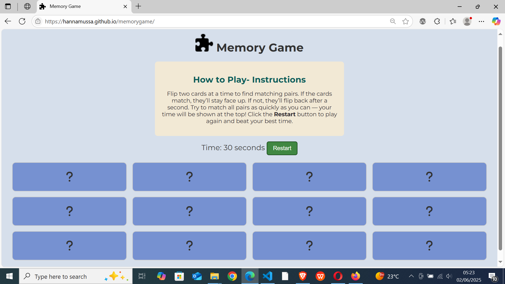

## Code Validation

To maintain code quality and detect major issues, each page has undergone validation.

The tables below outline the validation process, highlighting the specific errors found, validator screenshots, required corrections, and the final code amendments applied.

### HTML Validation

 Click here to view HTML Validation 

HTML was validated using [The W3C Markup Validation Service](https://validator.w3.org/).

| **Page**   | **Screenshot**                                                                                                              | **Changes to be Made**                             |
| ---------- | --------------------------------------------------------------------------------------------------------------------------- | -------------------------------------------------- |
| Games Page |  | No changes were made since it passed the validator |

 

### CSS Validation

 Click here to view the CSS Validation 

CSS was validated using [CSS Jigsaw Validator](https://jigsaw.w3.org/css-validator/).

| **Page**   | **Screenshot**                                                                               | **Changes to be Made**                             |
| ---------- | -------------------------------------------------------------------------------------------- | -------------------------------------------------- |
| Games Page |  | No changes were made since it passed the validator |

 

## Browser Compatibility

The website has been tested on the most commonly used browsers, including Google Chrome, Microsoft Edge, Mozilla Firefox, Opera, and Brave. The results of these tests are summarized below.

Click here to view the Browser Compatibility 

| Browser         | Screenshot                                                                 |
| --------------- | -------------------------------------------------------------------------- |
| Google Chrome   |    |
| Microsoft Edge  |   |
| Mozilla Firefox |  |
| Opera           |      |
| Brave           |      |

The game was compatible on all browsers, hence no changes were made.

## Responsiveness

The memory game features a fully responsive layout, delivering a smooth and consistent user experience across mobile, tablet, and desktop devices.

Click here to view the Memory Game responsiveness

| Device | Screenshot                                                                      |
| ------ | ------------------------------------------------------------------------------- |
| Laptop |  |
| Tablet |  |
| Mobile |  |

The game was responsive on all screen sizes, hence no changes were made.

## Lighthouse Audit

Chrome Lighthouse analyzes web pages for performance, accessibility, and SEO, providing detailed reports along with suggestions for improvement.

Click here to view the Lighthouse Audit 

| Page | Lighthouse Desktop Analysis                                                       | Lighthouse Mobile Analysis                                                      |
| ---- | --------------------------------------------------------------------------------- | ------------------------------------------------------------------------------- |
| Game |  |  |

The Lighthouse analysis was good for both desktop and mobile, hence no changes were made.

 

## WAVE Web Accessibility Evaluation Tool

The [WAVE](https://wave.webaim.org/) tool evaluates web pages for structural elements, color contrast, and accessibility issues, offering visual feedback.

Click here to view the WAVE Feedback 

The Memory Game passed the WAVE accessibility evaluation tool, as shown in the screenshot below.

 

## User Story Testing

Click here to view the User Story Testing

| **User Story**                                                                                                                                                   | **How the Game Fulfills It**                                                                                                                                                                                                                 | **Screenshot**                                                                   |
| ---------------------------------------------------------------------------------------------------------------------------------------------------------------- | -------------------------------------------------------------------------------------------------------------------------------------------------------------------------------------------------------------------------------------------- | -------------------------------------------------------------------------------- |
| As a casual player, I want to flip cards and match pairs so that I can enjoy a simple, fun game during my free time.                                             | Cards flip on click, revealing icons. Matching pairs are highlighted, providing a fun and easy-to-play experience.                                                                                                                           |      |
| As a returning user, I would like to have controls to easily navigate the game.                                                                                  | The game includes a restart button, allowing users to restart the game at any time. Players can also click on cards to reveal hidden icons based on their interactions. These features give players control and enhance the user experience. |                |
| As a returning user, I want to see my completion time at the end of each game so that I can track my progress and try to beat my personal best in future rounds. | A timer starts automatically and displays the total time taken once the game is completed, enabling progress tracking.                                                                                                                       |            |
| As a first-time user, I want the game instructions to be clear and visible so that I can start playing without confusion.                                        | Clear and visible instructions are provided on the main screen to guide new players on how to play.                                                                                                                                          |  |
| As a mobile user, I want the game to work smoothly on my phone or tablet so that I can play on any platform.                                                     | The layout is fully responsive and functions smoothly across different devices, including phones and tablets.                                                                                                                                |      |

## Testing Existing Features

Click here to view the testing for existing features

| **Feature**             | **Test Action**                                                      | **Expected Outcome**                                                                                                                           |
| ----------------------- | -------------------------------------------------------------------- | ---------------------------------------------------------------------------------------------------------------------------------------------- |
| **Game Board**          | Click on each card to check if it flips and shows an icon.           | A 12-card grid where each card reveals an icon when clicked.            |
| **Live Timer**          | Start the game and check if the timer starts on its own.             | Timer starts automatically when the game begins.                    |
| **Restart Button**      | Click the restart button to see if cards reshuffle and timer resets. | Cards are reshuffled and the timer goes back to zero.                   |
| **Win Message Display** | Match all card pairs to complete the game.                           | A win message appears showing the time taken.                       |
| **Responsive Design**   | A responsive game on desktop, tablet, and mobile screens.            | Layout adjusts properly to fit all screen sizes.                  |
| **Clear Instructions**  | Clear instructions section explaining the game.                      | Instructions are easy to understand and explain how to play.  |

## Bugs

Click here to view the Bugs 

| Screenshot                                                          | Bugs Encountered                                                                       | Changes Made                                                                               |
| ------------------------------------------------------------------- | -------------------------------------------------------------------------------------- | ------------------------------------------------------------------------------------------ |
|  | I used flippedCards.length > 2, which allowed more than 2 cards to flip at once.       | I changed it to >= 2 so only 2 cards can be flipped at a time before checking for a match. |
|  | I wrote card.cardList.remove("matched"), but cardList isn’t a property in JavaScript.  | I corrected it to card.classList.remove("matched") so it works correctly.                  |
|  | I wrote e.currenttarget with a lowercase "t". JavaScript didn’t understand it.         | I changed it to e.currentTarget with a capital "T", which is the correct spelling.         |
|  | I wrote inner.HTMLHTML which was a spelling error.                                     | I fixed the typo to innerHTML.                                                             |
|      | I used flippedCards.push() with no parameters inside the brackets.                     | I changed it to flippedCards.push(card) so the clicked card is added to the list.          |
|   | I used if (flippedCards.lgngth == 1), but only one card isn’t enough to check a match. | I changed it to == 2 so it checks for a match only after 2 cards are flipped.              |

## Unfixed Bugs

- At this time, no known unresolved bugs have been identified

## Javascript Testing

The JavaScript code was tested using [JS Lint](https://www.jslint.com/).
