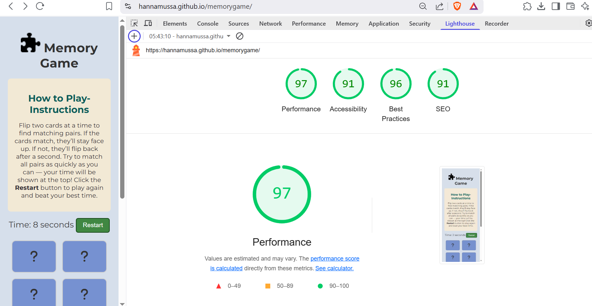

## Code Validation

To maintain code quality and detect major issues, each page has undergone validation.

The tables below outline the validation process, highlighting the specific errors found, validator screenshots, required corrections, and the final code amendments applied.

### HTML Validation

 Click here to view HTML Validation 

HTML was validated using [The W3C Markup Validation Service](https://validator.w3.org/).

| **Page**   | **Screenshot**                                                                                                              | **Changes to be Made**                             |
| ---------- | --------------------------------------------------------------------------------------------------------------------------- | -------------------------------------------------- |
| Games Page |  | No changes were made since it passed the validator |

 

### CSS Validation

 Click here to view the CSS Validation 

CSS was validated using [CSS Jigsaw Validator](https://jigsaw.w3.org/css-validator/).

| **Page**   | **Screenshot**                                                                               | **Changes to be Made**                             |
| ---------- | -------------------------------------------------------------------------------------------- | -------------------------------------------------- |
| Games Page |  | No changes were made since it passed the validator |

 

## Browser Compatibility

The website has been tested on the most commonly used browsers, including Google Chrome, Microsoft Edge, Mozilla Firefox, Opera, and Brave. The results of these tests are summarized below.

Click here to view the Browser Compatibility 

| Browser         | Screenshot                                                                 |
| --------------- | -------------------------------------------------------------------------- |
| Google Chrome   |    |
| Microsoft Edge  |   |
| Mozilla Firefox |  |
| Opera           |      |
| Brave           |      |

The game was compatible on all browsers, hence no changes were made.

## Responsiveness

The memory game features a fully responsive layout, delivering a smooth and consistent user experience across mobile, tablet, and desktop devices.

Click here to view the Memory Game responsiveness

| Device | Screenshot                                                                      |
| ------ | ------------------------------------------------------------------------------- |
| Laptop |  |
| Tablet |  |
| Mobile |  |

The game was responsive on all screen sizes, hence no changes were made.

## Lighthouse Audit

Chrome Lighthouse analyzes web pages for performance, accessibility, and SEO, providing detailed reports along with suggestions for improvement.

Click here to view the Lighthouse Audit 

| Page | Lighthouse Desktop Analysis                                                       | Lighthouse Mobile Analysis                                                      |
| ---- | --------------------------------------------------------------------------------- | ------------------------------------------------------------------------------- |
| Game |  |  |

The Lighthouse analysis was good for both desktop and mobile, hence no changes were made.

 

## WAVE Web Accessibility Evaluation Tool

The [WAVE](https://wave.webaim.org/) tool evaluates web pages for structural elements, color contrast, and accessibility issues, offering visual feedback.

Click here to view the WAVE Feedback 

 

## User Story Testing

Click here to view the User story testing 

## Testing Existing Features

Click here to view the testing for existing features

| **Feature**             | **Test Action**                                                      | **Expected Outcome**                                                                                                                           |
| ----------------------- | -------------------------------------------------------------------- | ---------------------------------------------------------------------------------------------------------------------------------------------- |
| **Game Board**          | Click on each card to check if it flips and shows an icon.           | A 12-card grid where each card reveals an icon when clicked.            |
| **Live Timer**          | Start the game and check if the timer starts on its own.             | Timer starts automatically when the game begins.                    |
| **Restart Button**      | Click the restart button to see if cards reshuffle and timer resets. | Cards are reshuffled and the timer goes back to zero.                   |
| **Win Message Display** | Match all card pairs to complete the game.                           | A win message appears showing the time taken.                       |
| **Responsive Design**   | A responsive game on desktop, tablet, and mobile screens.            | Layout adjusts properly to fit all screen sizes.                  |
| **Clear Instructions**  | Clear instructions section explaining the game.                      | Instructions are easy to understand and explain how to play.  |

## Bugs

Click here to view the Bugs 

## Unfixed Bugs

- At this time, no known unresolved bugs have been identified
